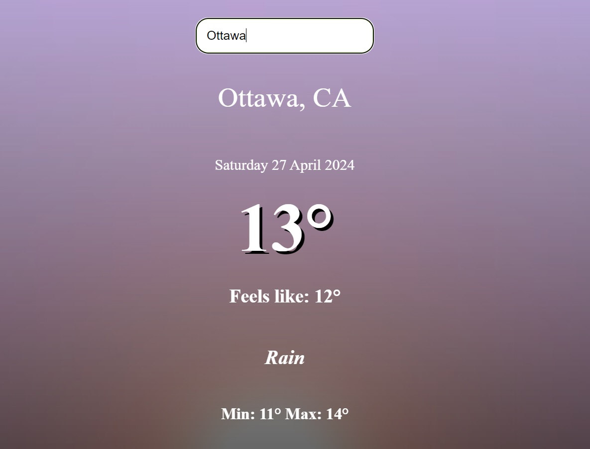

# Приложение о погоде

### Описание:

Одностраничное приложение о погоде. 
На странице этого приложения есть окно ввода, где можно указать любой город, и узнать какая там сейчас погода.

### Стек:

### Ссылка на рабочий сайт:
https://angilo4ik85.github.io/3prilozOpogode/

### Ссылка на GitHub Pages:
https://github.com/angilo4ik85/3prilozOpogode.git
